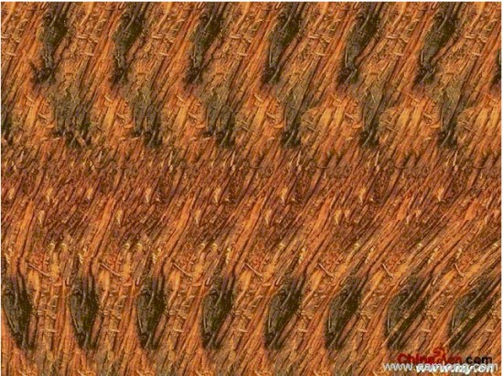

# 20個並行世界及其名稱--《反物質世界》五

上帝是最高明的數學家，宇宙中的一切都可以用數學（數字、算術、代數、幾何、三角、微積分、虛函數等）來表達、來演繹。

立體座標系展示了宇宙中並存的20個世界，經萬民草和滄海草的説明，表示20個並存世界的數學表達如下。

在平面座標系四象限上加上Z軸，從而產生20個象限，用階乘運算：

（5x4/2）+（5x4x3/3x2x1）=20

各個象限依次是：

XY、XZ、YZ、XYZ、XY（-Z） X（-Y）、X（-Z）、Y（-Z）、X（-Y）Z、X（-Y）（-Z） （-X）（-Y）、（-X）（-Z）、（-Y）（-Z）、（-X）（-Y）、（-X）（-Y）Z、（-X）（-Y）（-Z） （-X）Y、（-X）Z、（-Y）Z、（-X）Y、（-X）Y（-Z）

數學是抽象的世界，世界是形象的數學，數學之外沒有世界，世界之外沒有數學，以上20個象限，就是20個世界，除此之外，再沒有其他的世界。

為什麼我們只知道只有一個世界，卻不知道其他世界的存在呢？ 上一篇我已經解釋了原因，現在我們再進一步揭示。

首先，幾乎人人都做夢，我們在醒著時看不到夢中的世界，但我們無法否認夢境的存在。 同樣，我們也無法否認除人間之外其他19個世界的存在。

機緣巧合，冬梅草這幾天拿來了幾張三維立體圖，我們觀看三維立體圖，就能從司空見慣平凡無奇的平面圖中看到其內的立體圖形。 我們再來看幾張。

1.這是一張“春”圖。

&#x20;

<figure><figcaption></figcaption></figure>

2.這是一張“福”倒圖。

&#x20;

<figure><figcaption></figcaption></figure>

3.這是美人魚圖。

&#x20;

<figure><figcaption></figcaption></figure>

4.這是斧劈木柴圖。

&#x20;

<figure><figcaption></figcaption></figure>

5.這是一把摺疊椅圖。

&#x20;

<figure><figcaption></figcaption></figure>

6.這是宇宙飛船圖。

&#x20;

<figure><figcaption></figcaption></figure>

7.這是兩把鎖子圖。

&#x20;

<figure><figcaption></figcaption></figure>

8.這是圓筒性喇叭圖。

&#x20;

<figure><figcaption></figcaption></figure>

以上8張圖中的真實內容大家看到了嗎？ 如果你沒看到，你將會說這些圖中沒有什麼，任憑別人怎麼說，你將半信半疑，甚至根本不相信。 但是，不論你看到沒看到，裡面不僅有圖，且是立體的。 真實的存在不會因為我們看到沒看到而不存在。

同樣，虛數軸存在著，這個宇宙中除了地球人間外還並行存在著19個世界，不論你看到沒看到，它們是存在的，我們無法否認。

不論是誰，是神耶穌、是佛釋迦牟尼、是仙人老子、是先知穆罕默德、是其他任何奇異人物，只要談到世界，絕對跑不出這20個並行世界。

為了便於大家理解和記憶，我給這20個並行世界取名稱如下。

1.人間。 即XY世界。

2.動物層。 即X（-Y） 世界。

3.植物層。 即（-X）Y 世界。

4.陰間。 即（-X）（-Y）世界。

5.人仙界。 即XZ世界。

6.陰陽兩界間。 即 X（-Z）世界。

7.冰凍層。 即（-X）（-Z）世界。

8.鬼仙界。 即 （-X）Z世界。

9.陽極黑洞體。 即YZ世界。

10.微生命世界。 即Y（-Z）世界。

11.火煉層。即（-Y）（-Z）世界。

12.反復無常生命世界。 即（-Y）Z世界。

13.天界（神佛世界、極樂界、仙島群島洲）。 即XYZ世界。

14.菩薩世界。即X（-Y）Z 世界。

15.陰極黑洞體。 即（-X）（-Y）Z世界。

16.天使神仙世界。 即（-X）YZ世界。

17.千年界。 即XY（-Z）世界。

18.萬年界。即X（-Y）（-Z）世界。

19.魔妖世界。即（-X）（-Y）（-Z）世界。

20.三界往返洲。即（-X）Y（-Z）。

以上名稱只是我臨時取用，不用這些名稱，理解上有難度，用了這些名稱，思維上就會受到限制。 為了更好地理解，以後我或許會用更加確切的名稱替代。 最關鍵的是，每個人要自己體驗到，你體驗到了，就會發現這些名稱毫無疑義，這些名稱反而是一種嚴重的障礙。

不名不行，名了，就把內涵和外延縮小扭曲了，大家記住：名可名，非常名。 最好不要受這些名稱的束縛，一旦明白了，趕快把這些名稱拋棄，因為這些名稱極不科學。 最好的辦法是，掌握無相思維和渾沌思維，一旦看透了，你會罵我簡直是把芝麻當成了西瓜，但在你沒看透前，我給的敲門磚還是起作用的。

2007-5-22

